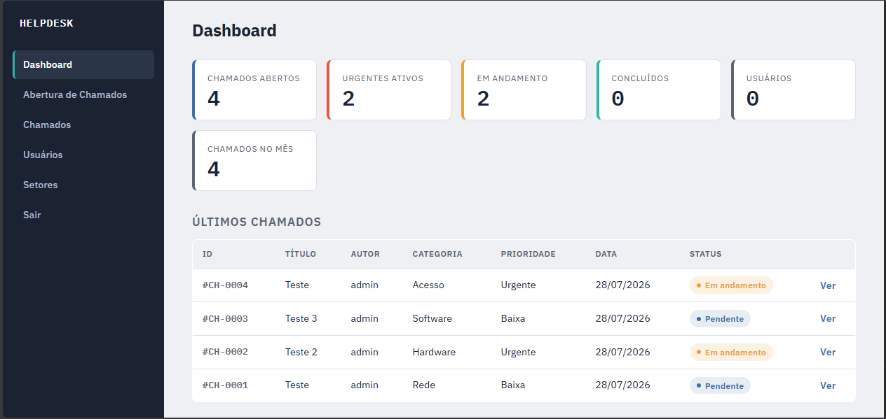
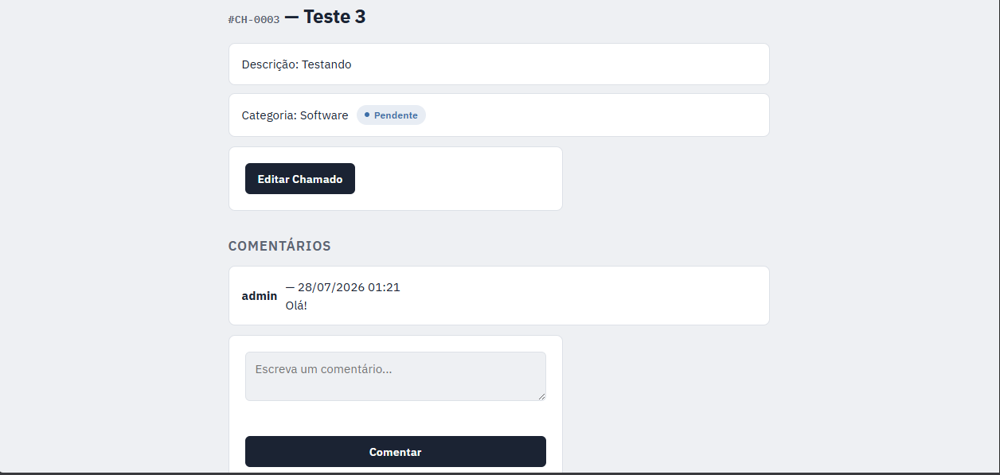

# 🎫 HelpDesk — Sistema de Gestão de Chamados de TI

Sistema web para abertura, acompanhamento e gestão de chamados de suporte técnico, desenvolvido com Flask. Permite que colaboradores de uma empresa abram chamados para o time de TI, acompanhem o andamento e se comuniquem através de comentários, enquanto administradores gerenciam setores, usuários e o fluxo completo dos chamados.

🔗 **Aplicação no ar:** [falqxy.pythonanywhere.com](https://falqxy.pythonanywhere.com)

## Screenshots

### Painel Administrativo


### Detalhes do Chamado


## Funcionalidades

- **Autenticação e autorização** — login com senha criptografada (Werkzeug) e controle de acesso por papéis (administrador / cliente)
- **Gestão de Setores** — cadastro, edição e exclusão (com proteção contra exclusão de setores com usuários vinculados)
- **Gestão de Usuários** — cadastro de colaboradores vinculados a um setor
- **Chamados** — abertura com categoria e prioridade, acompanhamento de status (Pendente / Em andamento / Concluído)
- **Comentários** — histórico de conversa dentro de cada chamado, entre solicitante e equipe de TI
- **Busca** — pesquisa de chamados e usuários por múltiplos campos
- **Paginação** — listagens paginadas no back-end (Flask-SQLAlchemy)
- **Painel administrativo** — dashboard com indicadores (chamados abertos, urgentes, em andamento, concluídos, etc.)
- **Páginas de erro customizadas** — 404 e 500

## Tecnologias

- **Back-end:** Python, Flask
- **Banco de dados:** SQLite + SQLAlchemy (ORM) + Flask-Migrate (Alembic)
- **Front-end:** HTML, CSS, Jinja2
- **Autenticação:** Werkzeug Security (hash de senha)
- **Arquitetura:** Blueprints + Application Factory pattern
- **Deploy:** PythonAnywhere

## Estrutura do projeto

```
Help-Desk/
├── app/
│   ├── __init__.py       # Application Factory
│   ├── decorators.py     # login_obrigatorio / admin_obrigatorio
│   ├── models.py         # Setor, Usuario, Chamado, Comentario
│   ├── main.py           # Blueprint: home, login, cadastro, painel admin
│   ├── usuario.py        # Blueprint: CRUD de usuários
│   ├── setor.py          # Blueprint: CRUD de setores
│   ├── chamado.py        # Blueprint: CRUD de chamados + comentários
│   ├── static/           # CSS
│   └── templates/        # Templates Jinja2
├── migrations/           # Histórico de migrations (Alembic)
├── comandoadm.py         # Script para criar setor + usuário admin inicial
├── run.py                # Ponto de entrada da aplicação
└── requirements.txt
```

## Como rodar localmente

### Pré-requisitos
- Python 3.10+
- pip

### 1. Clone o repositório
```bash
git clone https://github.com/brunovazdev/Help-Desk.git
cd Help-Desk
```

### 2. Crie e ative um ambiente virtual
```bash
python -m venv venv

# Windows
venv\Scripts\activate

# Linux/Mac
source venv/bin/activate
```

### 3. Instale as dependências
```bash
pip install flask flask-sqlalchemy flask-migrate python-dotenv
```

### 4. Configure as variáveis de ambiente
Crie um arquivo `.env` na raiz do projeto:
```env
SECRET_KEY=escolha-uma-chave-secreta
DATABASE_URL=sqlite:///dados.db
```

### 5. Rode as migrations
```bash
flask db upgrade
```

### 6. Crie o setor e o usuário administrador inicial
```bash
python comandoadm.py
```
Isso cria um setor "TI" e um usuário admin (`admin@teste.com` / `123456`) — edite o `comandoadm.py` antes de rodar se quiser outros dados.

### 7. Inicie o servidor
```bash
python run.py
```
A aplicação estará disponível em `http://127.0.0.1:5000`.

## Modelo de dados

```
Setor (1) ──── (N) Usuario (1) ──── (N) Chamado (1) ──── (N) Comentario
                                          │
                                          └── (N) Comentario (N) ──── (1) Usuario [autor]
```

- Um **Setor** possui vários **Usuários**
- Um **Usuário** possui vários **Chamados**
- Um **Chamado** possui vários **Comentários**
- Um **Comentário** pertence a um **Chamado** e a um **Usuário** (autor)

## Autor

Desenvolvido por [Bruno Vaz](https://github.com/brunovazdev) como projeto de estudo em desenvolvimento back-end com Flask.